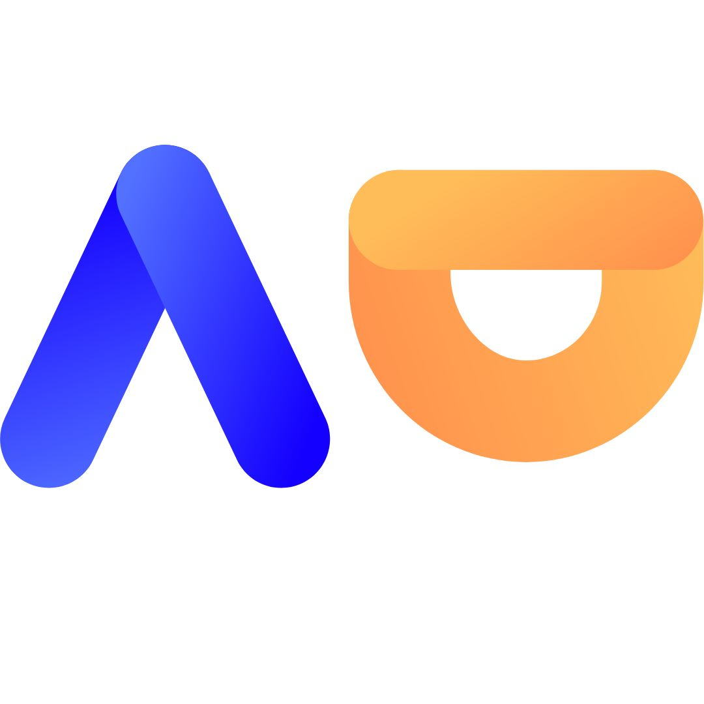

<br />
<div align="center">
  <a href="https://github.com/JayeshVP24/AICTE-Diary">
    
  </a>

  <h3 align="center">Activity Dekho</h3>

  <p align="center">
    AICTE Dairy - To Help Organize and Maintain your Points
    <br />
    <a href="https://github.com/JayeshVP24/AICTE-Diary"><strong>Explore the docs »</strong></a>
    <br />
    <br />
    <a href="https://github.com/JayeshVP24/AICTE-Diary">View Demo</a>
    ·
    <a href="https://github.com/JayeshVP24/AICTE-Diary/issues">Report Bug</a>
    ·
    <a href="https://github.com/JayeshVP24/AICTE-Diary/issues">Request Feature</a>
  </p>
</div>


<details>
  <summary>Table of Contents</summary>
  <ol>
    <li><a href="#About">About</a></li>
    <li><a href="#Features">Features</a></li>
    <li><a href="#Tech-Stack">Tech Stack</a></li>
    <li><a href="#Languages-and-Tools">Languages and Tools</a></li>
    <li><a href="#Workflow">Workflow</a></li>
    <li><a href="#Instructions-on-running-project-locally">Instructions on running project locally</a></li>
    <li><a href="#Contributing">Contributing</a></li>
    <li><a href="#Guide">Guide</a></li>
    <li><a href="#Feedback">Feedback</a></li>
    <li><a href="#Support">Support</a></li>
    <li><a href="#License">License</a></li>

  </ol>
</details>

------

## About

Do you have difficulty remembering the events that you have attended and maintaining your record feels tedious. Activity Dekho application allows you to track events you've attended and maintains a record as a proof of attendance 🏫. Activity Dekho aims to provide a centralised and automated system for managing and distributing activity points. This system will allow students to easily view their current activity points balance and track their progress over time, while also enabling administrators to input the data records 📋

The application also helps the Organization /Clubs /Communities to organize, maintain and distribute the AICTE credits hours easily by putting the data on platform. It provides a one stop platform for any queries associated with the Activity Dekho 📝.

## Features

🗄️ It aims to organize and store the data of the events that are conducted by the organization.

👨‍🎓 Systematically providing AICTE points to an individual user (student).

💯 Platform helps to provide proof of attendance and work done for AICTE Points eligibility.

🆕 Assists in keeping the AICTE diary up-to-date.


## Tech Stack

**Frontend** - Next.js, Chakra UI, TailwindCSS

**Backend** - Firebase

**Framework** - Xstate

**Database** - Firestore


## Languages and Tools

<p align="left"> <a href="https://www.gnu.org/software/bash/" target="_blank" rel="noreferrer">  </a> <a href="https://www.w3schools.com/css/" target="_blank" rel="noreferrer">  </a> <a href="https://git-scm.com/" target="_blank" rel="noreferrer">  </a> <a href="https://www.w3.org/html/" target="_blank" rel="noreferrer">  </a> <a href="https://developer.mozilla.org/en-US/docs/Web/JavaScript" target="_blank" rel="noreferrer">  </a> <a href="https://www.linux.org/" target="_blank" rel="noreferrer">  </a> <a href="https://tailwindcss.com/" target="_blank" rel="noreferrer"> </a><a href="https://nextjs.org/" target="_blank" rel="noreferrer">  </a> <a href="https://nodejs.org" target="_blank" rel="noreferrer">  </a>
 
 
 ## WorkFlow
 
📜 Student or administrator logs in to the system using their unique academic credentials or club credential respectively.

📊 Student views their dashboard, which displays their current activity points balance and a history of their participation in extracurricular and co-curricular activities.

📋 Administrator inputs the participation of students in various activities, including assigning hours for each activity.

🔁 Business logic component processes the input data and updates the activity points balances for each student.

📝 Students can generate reports on the distribution of activity points, including the breakdown of hours provided from various activities.

🗄️ System stores the data and updates the activity points balances in the database.


 
 ## Instructions on running project locally:

Clone the project

```bash
  git clone https://github.com/JayeshVP24/AICTE-Diary.git
```

Install dependencies:

```bash
  cd AICTE-dairy/
  
  yarn install
```

Run Project on terminal

```bash
  yarn dev
```

Start the server

```bash
  http://localhost:3000
```


## Authors

🔆 [@Jayesh Potlabattini](https://github.com/Mr-Jayesh)

🔆 [@Hrishikesh Yadav](https://www.github.com/hrishikesh332)

🔆 [@Prathik Shetty](https://www.github.com/prathikshetty2002)


## Contributing

Contributions are always welcome!

See `CONTRIBUTING.md` for ways to get started.

Please adhere to this project's `CODE_OF_CONDUCT.md`.

## Guide

A guideline of project composition and creation.

soon adding `guide.md`

Please adhere to this project's `CODE_OF_CONDUCT.md`.

## Feedback

If you have any feedback, please reach out to us at **jayeshpotlabattini24@gmail.com**


## Support

For support join our Slack channel - [AMA](https://ml-geeksworkspace.slack.com/archives/C03K2M9SBAA)

## License

[](https://www.gnu.org/licenses/gpl-3.0)

